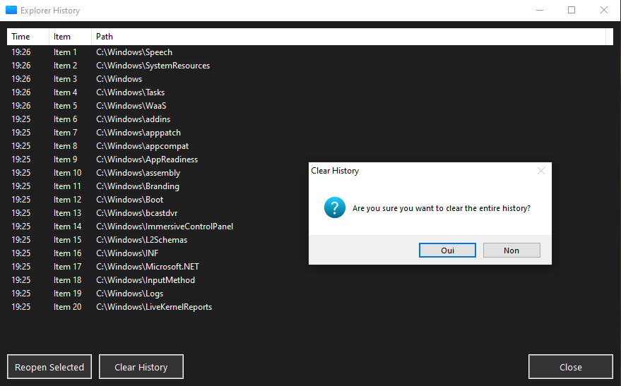
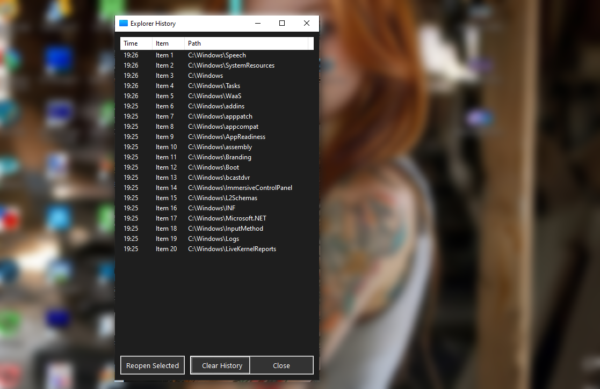
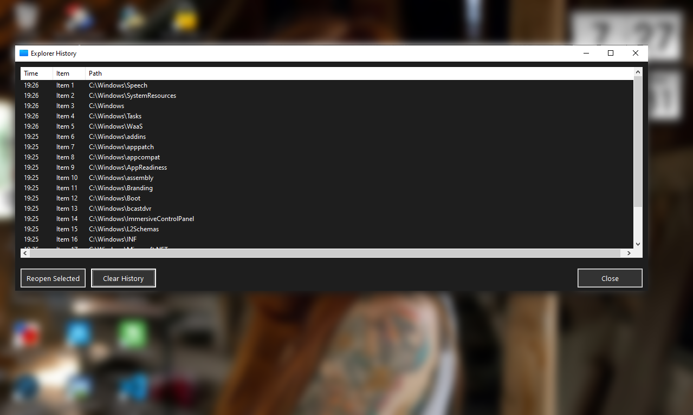
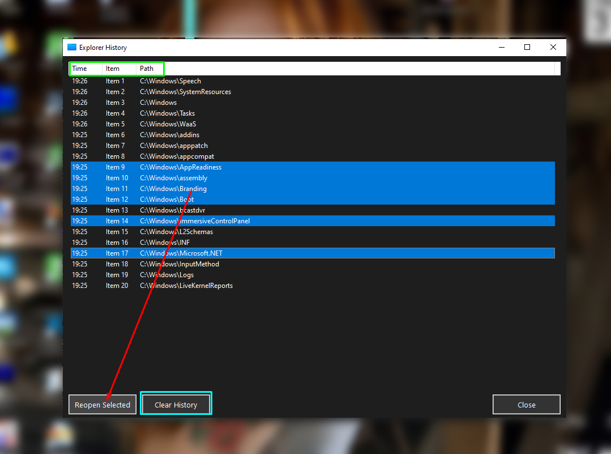
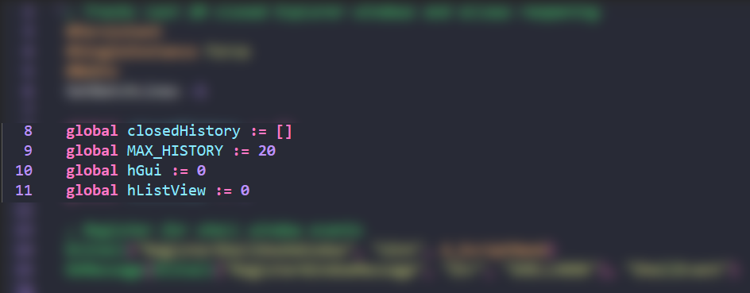

📂 Explorer Window History Tracker
Never lose track of closed folders again!  
This AutoHotkey script automatically tracks your last 20 closed Windows Explorer windows and lets you reopen them instantly.

---

✨ Features
- 🕐 Automatic Tracking - Monitors all Explorer windows in real-time  
- 💾 History Persistence - Keeps track of your last 20 closed folders  
- 🎯 Multiple Detection Methods - Catches both Alt+F4 and close button clicks  
- 🖱️ Multi-Selection Support - Reopen multiple folders at once  
- ⚡ Quick Access - Press Ctrl+Shift+H to view your history  
- 🎨 Dark Theme GUI - Easy on the eyes with modern styling  
- 📏 Resizable Window - Adjust the interface to your preference  
- 🔄 Smart Deduplication - Automatically removes duplicate entries  
- ⏰ Timestamps - See when each folder was closed  
- 🚀 Double-Click to Open - Quickly reopen any folder from the list  

---

🚀 Installation
1. Install AutoHotkey v1.1+ if you haven't already  
2. Download TrackLastOpened_Folders.ahk from this repository  
3. Double-click the script to run it  
4. (Optional) Add to your Startup folder to run automatically on Windows boot  

---

📖 How to Use

Basic Usage
- Run the script - The tracker runs silently in the background  
- Close any Explorer windows - They're automatically saved to history  
- Press Ctrl+Shift+H - Opens the history GUI  
- Select and reopen - Choose folders to reopen from your history  

Multi-Selection
- Click individual items to select them  
- Ctrl+Click to select multiple non-consecutive items  
- Shift+Click to select a range of items  
- Click "Reopen Selected" or double-click any item to open  

Keyboard Shortcuts
| Shortcut      | Action                  |
|---------------|-------------------------|
| Ctrl+Shift+H  | Show/hide history window|
| Double-Click  | Reopen selected folder  |
| Esc           | Close history window    |

---

⚙️ Customization

Adjust Maximum History Size
`
global MAX_HISTORY := 20
`
Change 20 to any number you prefer (e.g., 50, 100, etc.)

Change Hotkey
`
^+h::ShowHistoryGUI()
`
Modify the hotkey symbols:  
- ^ = Ctrl  
- + = Shift  
- ! = Alt  
- # = Win  

Example: ^!h = Ctrl+Alt+H

Adjust Polling Interval
`
SetTimer, TrackWindows, 2000
`
Change 2000 (milliseconds) to adjust how often the script checks for closed windows.  
Lower values = faster detection but more CPU usage.

---

🎨 GUI Features
- Time Column - Shows when each folder was closed (HH:MM format)  
- Item Number - Quick reference for each history entry  
- Full Path - Complete folder location  
- Reopen Selected - Opens all selected folders in new Explorer windows  
- Clear History - Removes all tracked folders (with confirmation)  
- Resizable Window - Drag edges to resize; columns adjust automatically  

---

🔧 Technical Details
- Dual Tracking System: Uses both shell hook events and polling for reliability  
- Works with both close methods: Catches Alt+F4 and clicking the X button  
- Automatic cleanup: Removes non-existent paths from history  
- No duplicates: Keeps your history clean by removing duplicate entries  
- Memory efficient: Only stores path and timestamp data  
- Always on top: GUI stays visible for easy access  

---

📋 Requirements
- Windows 7 or later  
- AutoHotkey v1.1 or later  
- No additional dependencies  

---

🐛 Troubleshooting
- Script not tracking closed windows?  
  Ensure the script is running (check system tray for AutoHotkey icon)  
  Try running as administrator if you have permission issues  

- Folders not reopening?  
  Check if the folder still exists at that path  
  Network drives may take longer to open  

- GUI not showing?  
  Press Ctrl+Shift+H again to toggle  
  Check if it's hidden behind other windows  

---

📝 Notes
- History is cleared when the script restarts  
- Network paths are supported but may be slower to open  
- The script runs with low CPU usage (~0-1%)  
- Dark theme GUI with intentionally kept light header for better contrast 😊  

---

🤝 Contributing
Feel free to submit issues, fork the repository, and create pull requests for any improvements!

---

📄 License

---

This project is open source and available for personal and commercial use.  
Made with ❤️ for Windows Explorer power users  

---

📌  🏝️ Some Screenshots (OverView) 🏝️

---

📣 Full Gui 

---

🌻 Resizable Window Pic1 🌻

---

📣 Resizable Window Pic2 📣

---

👉 Reopen Multiselected Items 👈

---

❄️ Ability to extend the Max History (20 by default) ❄️

---

